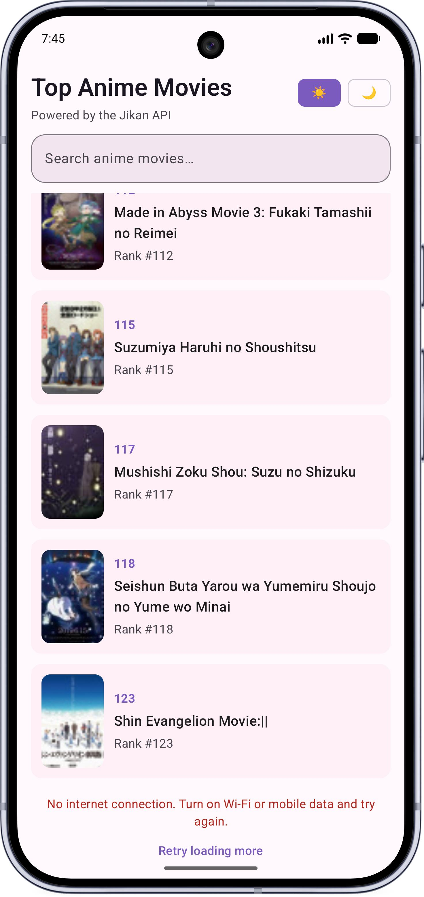
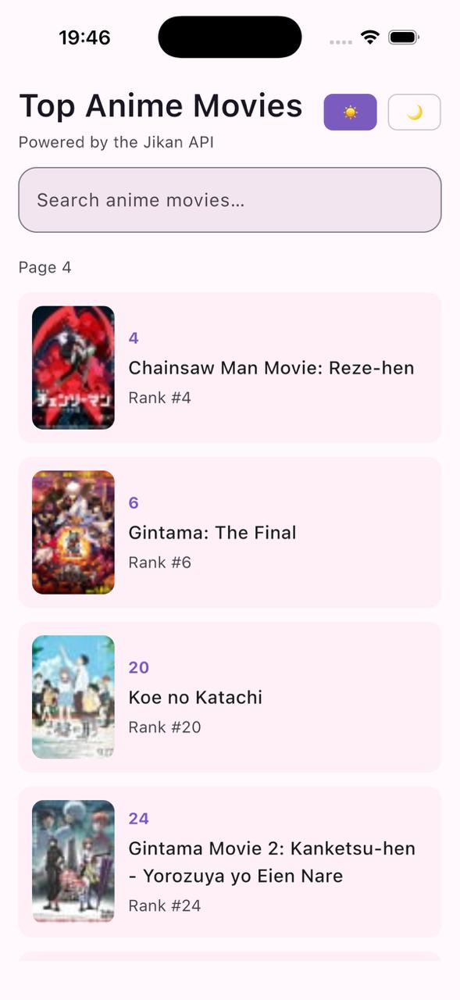
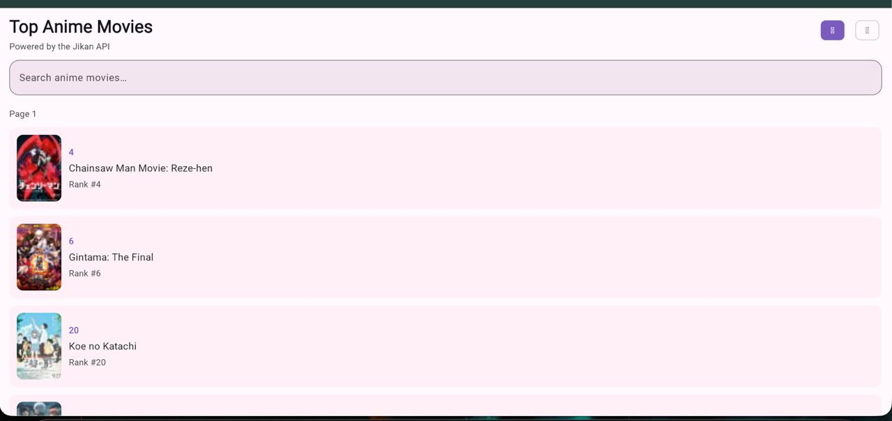

# Anime Movies (Compose Multiplatform)

A Kotlin Multiplatform app that browses top anime movies from the [Jikan API](https://jikan.moe/). One shared UI and business layer runs on **Android**, **iOS**, and **Web (Wasm)**.

## Features

- **Top anime movies** — paginated list from Jikan (`type=movie`)
- **Search** — debounced movie search with minimum query length
- **Movie details** — poster, synopsis, score, content rating, and genres
- **Navigation** — type-safe routes with Navigation Compose (easy to add more screens)
- **Themes** — light and dark Material 3 color schemes
- **Posters** — Coil image loading with placeholders on all platforms
- **Resilience** — loading, empty, and error states; offline detection; retry capped at 2 attempts
- **API logging** — Ktor client logs requests across platforms

## Screenshots

The same Compose Multiplatform UI on Android, iOS, and Web (Wasm).

| Android | iOS | Web |
| :---: | :---: | :---: |
|  |  |  |

## Tech stack

| Layer | Libraries |
| --- | --- |
| UI | Compose Multiplatform, Material 3 |
| Navigation | `org.jetbrains.androidx.navigation:navigation-compose` |
| Networking | Ktor Client, kotlinx.serialization |
| Images | Coil 3 |
| Architecture | MVVM, repository pattern, use cases |
| DI | Manual (`AppModule`) |
| Async | Coroutines, `StateFlow` |

**Kotlin** 2.3.21 · **Compose** 1.11 · **AGP** 9.0.1 · **minSdk** 24

## Project structure

```text
Movie-App/
├── androidApp/          # Android application entry (MainActivity)
├── composeApp/          # Shared KMP module (UI, domain, data, network)
│   └── src/
│       ├── commonMain/  # Shared Kotlin + Compose
│       ├── androidMain/
│       ├── iosMain/
│       ├── wasmJsMain/
│       └── commonTest/
└── iosApp/              # Xcode project (Swift shell + ComposeApp framework)
```

Shared package: `com.svksri.animemovies`

| Package | Responsibility |
| --- | --- |
| `core/` | Results, errors, constants, dispatchers |
| `network/` | Ktor client, API service, DTOs |
| `data/` | Repository implementation, mappers |
| `domain/` | Models, repository contract, use cases |
| `validation/` | Movie validation rules |
| `presentation/` | `MoviesViewModel`, UI state |
| `navigation/` | Type-safe routes and `NavHost` graph |
| `ui/` | Compose screens and components |
| `di/` | `AppModule` wiring |

## Architecture

```text
UI (Compose) → ViewModel → Use cases → Repository → Jikan API
```

- **List flow:** `GetMoviesUseCase` / `SearchMoviesUseCase` → `AnimeRepository` → `AnimeApiService`
- **State:** `MoviesUiState` (`Loading`, `Success`, `Empty`, `Error`)
- **Navigation:** `MoviesListRoute` and `MovieDetailRoute` in `navigation/AppRoute.kt`, registered in `navigation/AppNavGraph.kt`

### Adding a new screen

1. Define a `@Serializable` route in `navigation/AppRoute.kt`.
2. Add a `composable<YourRoute> { ... }` entry in `navigation/AppNavGraph.kt`.
3. Navigate with `navController.navigate(YourRoute)`.

## API

| Purpose | Endpoint |
| --- | --- |
| Top movies | `GET /v4/top/anime?type=movie&page={page}` |
| Search | `GET /v4/anime?q={query}&type=movie&page={page}` |

Base URL: `https://api.jikan.moe`

Jikan is a community API; respect [rate limits](https://jikan.moe/) and avoid hammering the service in development.

## Prerequisites

- **JDK 17+** (Gradle toolchain)
- **Android Studio** Ladybug or newer (for Android)
- **Xcode 15+** with iOS SDK (for iOS simulator/device)
- **Node.js** (optional, for some Wasm tooling if prompted by Gradle)

## Run the app

### Android

```bash
./gradlew :androidApp:assembleDebug
```

Install the APK from `androidApp/build/outputs/apk/debug/`, or run from Android Studio by opening the project root and selecting the `androidApp` configuration.

### iOS

1. Build the shared framework (optional sanity check):

   ```bash
   ./gradlew :composeApp:compileKotlinIosSimulatorArm64
   ```

2. Open `iosApp/iosApp.xcodeproj` in Xcode.
3. Select an **iOS Simulator** target (arm64).
4. **Product → Run**.

Xcode runs `iosApp/compile-kotlin-framework.sh` to produce the `ComposeApp` framework. The script uses a project-local `.gradle` directory to avoid common sandbox/permission issues with the Gradle wrapper.

If the framework is missing, run **Product → Clean Build Folder** and build again.

### Web (Wasm)

Development server:

```bash
./gradlew :composeApp:wasmJsBrowserDevelopmentRun
```

Production bundle:

```bash
./gradlew :composeApp:wasmJsBrowserDistribution
```

Output: `composeApp/build/dist/wasmJs/productionExecutable/`

Browser back/forward is wired via `bindToBrowserNavigation()` in the Wasm entry point.

## Tests

```bash
./gradlew :composeApp:cleanAllTests :composeApp:allTests
```

Unit tests live in `composeApp/src/commonTest/` (validators, use cases, mappers).

## Build verification

These tasks have been used to verify the project:

```bash
./gradlew :androidApp:assembleDebug
./gradlew :composeApp:compileKotlinIosSimulatorArm64
./gradlew :composeApp:compileKotlinWasmJs
./gradlew :composeApp:wasmJsBrowserDistribution
```

## License

This project is a proof-of-concept sample. Jikan data is provided by the community; see [jikan.moe](https://jikan.moe/) for API terms.
